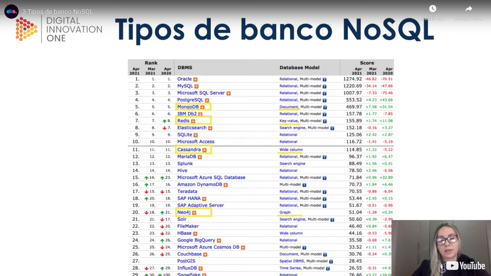

# General

[Course](https://web.dio.me/course/introducao-ao-mongodb-e-bancos-de-dados-nosql/learning/d8c1eb33-27f5-44f9-a57c-68d65fcac8da?back=/track/coding-the-future-claro-java-spring-boot&tab=undefined&moduleId=undefinedhttps://web.dio.me/course/introducao-ao-mongodb-e-bancos-de-dados-nosql/learning/d8c1eb33-27f5-44f9-a57c-68d65fcac8da?back=/track/coding-the-future-claro-java-spring-boot&tab=undefined&moduleId=undefined)

## Introducton - needs

Needs foor NoSQL:

- Some specialists say that the "we" double the volume of data stored every year;
- "We" develop more and more apps with a non conventional behaviour;
- "We" have a demand for scalable applications.

The deficiencies of SQL databases make born the NoSQL databases.

## Differences between SQL and NoSQL

### Scalability

- In SQL databases is more related to a vertical scalability and NoSQL to a horizontal scalability (although obviousy NoSQL can also gain the benefits of vertical scalablity). There are cases of relational databases that have horizontal scalability also, like MySQL cluster, but this databases are related to data reading. The data sharing between replicas in a NoSQL scenario is named "`sharding`".

As in a NoSQL world is more easy to deal with the question of the horizontal scalability, you can interact better with a non constant request level, as you can scale horizontally more easy.

### Schemas or structure

- In a SQL world you need a rigid definition of tables and other things like relations and in a NoSQL world you almost no need to pre define a structure;

### Use of SQL or no

- In the relational databases world SQL is the language used and in the NoSQL world, SQL is not used (or not used often).

### Performance

- As SQL databases is more frequent related to vertical scalability, the permormance is often increased by upgrading the hardware, like disks, bur in the case of NoSQL databases, as they are often linked to a horizonal scalability, the often receives a performance increase by the things like the size of the cluster and the performance of the network of the cluster.

### Transactions

Please see the next image:

In general the NoSQL databases do not have the concept of `"transaction"` except for MongoDB. They do not use "`transactions`" to increase high availability and performance.

### Advantages of NoSQL

- Flexibility;
- Scalability;
- High performance.

## Types of NoSQL databases

The thing that is common between the several types of NoSQL databases is that they do not use SQL (in most part of the time, they do not depends on SQL).
We have this image about a ranking of a use of databases:

The types of NoSQL databases:

Some comments:

- Document store: common, can store documents like JSON or XML;
- Key value: often used for cache;
- Oriented to columns: more next to relational databases;
- Graphs: used on social networks, games, filesystems or fraud detection as example

## NoSQL databases - graphs

Please initially see this image:

Basically this type of database contains `nodes` and `vertices`. `Nodes` are the data and `vertices` are the relations.