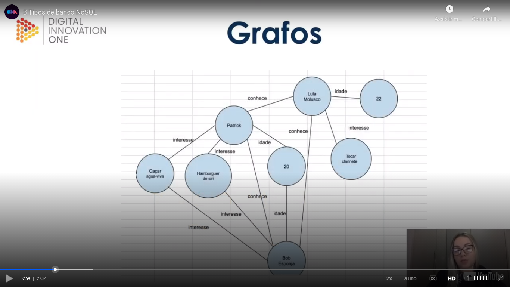
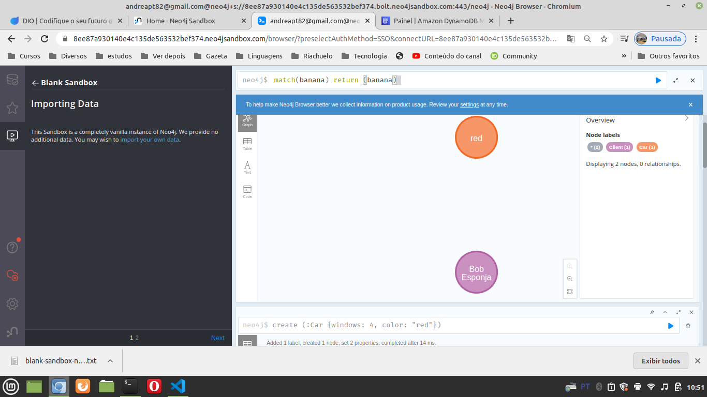
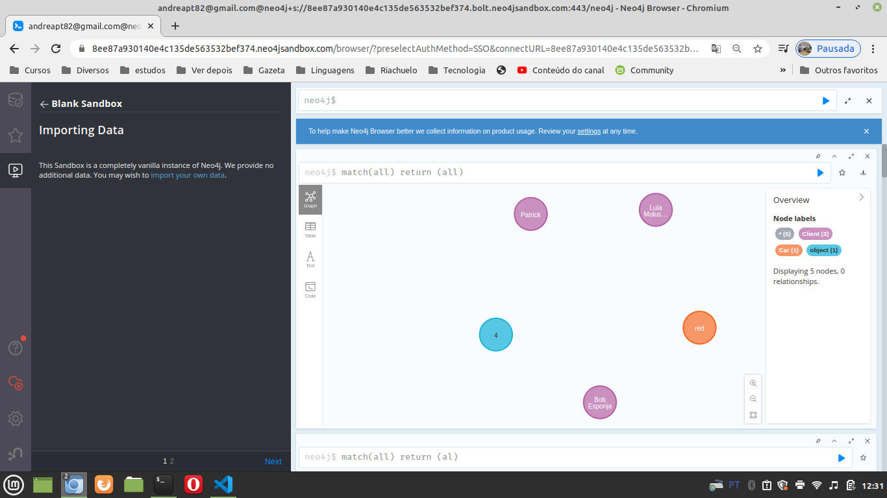
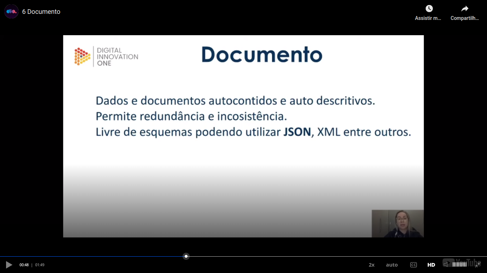

# General

[Course](https://web.dio.me/course/introducao-ao-mongodb-e-bancos-de-dados-nosql/learning/d8c1eb33-27f5-44f9-a57c-68d65fcac8da?back=/track/coding-the-future-claro-java-spring-boot&tab=undefined&moduleId=undefinedhttps://web.dio.me/course/introducao-ao-mongodb-e-bancos-de-dados-nosql/learning/d8c1eb33-27f5-44f9-a57c-68d65fcac8da?back=/track/coding-the-future-claro-java-spring-boot&tab=undefined&moduleId=undefined)


## Introducton - needs

Needs for NoSQL:

- Some specialists say that the "we" double the volume of data stored every year;
- "We" develop more and more apps with a non conventional behaviour;
- "We" have a demand for scalable applications.

The deficiencies of SQL databases make born the NoSQL databases.


## Differences between SQL and NoSQL

### Scalability

- In SQL databases is more related to a vertical scalability and NoSQL to a horizontal scalability (although obviousy NoSQL can also gain the benefits of vertical scalablity). There are cases of relational databases that have horizontal scalability also, like MySQL cluster, but this databases are related to data reading. The data sharing between replicas in a NoSQL scenario is named "`sharding`".

As in a NoSQL world is more easy to deal with the question of the horizontal scalability, you can interact better with a non constant request level, as you can scale horizontally more easy.

### Schemas or structure

- In a SQL world you need a rigid definition of tables and other things like relations and in a NoSQL world you almost no need to pre define a structure;

### Use of SQL or no

- In the relational databases world SQL is the language used and in the NoSQL world, SQL is not used (or not used often).

### Performance

- As SQL databases is more frequent related to vertical scalability, the permormance is often increased by upgrading the hardware, like disks, bur in the case of NoSQL databases, as they are often linked to a horizonal scalability, the often receives a performance increase by the things like the size of the cluster and the performance of the network of the cluster.

### Transactions

Please see the next image:


In general the NoSQL databases do not have the concept of `"transaction"` except for MongoDB. They do not use "`transactions`" to increase high availability and performance.

### Advantages of NoSQL

- Flexibility;
- Scalability;
- High performance.

## Types of NoSQL databases

The thing that is common between the several types of NoSQL databases is that they do not use SQL (in most part of the time, they do not depends on SQL).
We have this image about a ranking of a use of databases:


The types of NoSQL databases:


Some comments:

- Document store: common, can store documents like JSON or XML;
- Key value: often used for cache;
- Oriented to columns: more next to relational databases;
- Graphs: used on social networks, games, filesystems or fraud detection as example

## NoSQL databases - graphs

Please initially see this image:



Basically this type of database contains `nodes` and `vertices`. `Nodes` are the data and `vertices` are the relations.

Ranking of databases oriented to graphs most used:


About Neo4j:
- Uses the language "cypher";
- Apply the ACID (atomicity, consistency, isolation, durability) properties;
- Is the leader in the previous image :).

In the class we used [this sandbox](https://sandbox.neo4j.com/) of Neo4j.

We created a balnk database and in this blank database we could create a registry using the next command:

```
create (:Client {name: "Bob Esponja", age: 28, hobbiees:["Caçar água-viva", "comer hamburguer"]})
```

The output was "`Added 1 label, created 1 node, set 3 properties, completed after 75 ms.`".

I also inserted another node with this command:

```
create (:Car {windows: 4, color: "red"})
```

The output was "`Added 1 label, created 1 node, set 2 properties, completed after 14 ms.`".

We can consult all nodes using the next command as example. I used "banana" to demonstrate that this variable name do not matter:

```
match(banana) return (banana)
```

The output of the above command was:



You can saw that we can consult all the documents without type a paramenter related to a thing like a table.

With the next command we can create two nodes and a relationship:

```
create (:Client {name: "Lula Molusco", age: 50}) - [:Bloqueado] -> (:Client{name: "Patrick", hooblies : ["caçar água viva"]})
```

The return of the previous command:

```
Added 2 labels, created 2 nodes, set 4 properties, created 1 relationship, completed after 15 ms.
```

We resulted in this image after inserting more data


We can also insert an empty object this way:

```
create(:object)
```

An the graph will be now:


Different colors? Yes, because they have different labels (teacher said about properties, but I saw that different labes result in different colors as you can see comparing all images).

With this script we can create a new "Bloqueado" relation:

```
match(lula:Client{name: "Lula Molusco"}), (patrick: Client {name: "Patrick"}) create (lula) -[:Bloqueado] -> (patrick)
```

Explanation: we was getting two datas with the label "client" related to the parameters to filter (example "{name: "Lula Molusco"}) and this returned data was saved in variables ("lula" and "patrick"). After the dash signal ("-") with this two variables we created a "Bloqueado" relation.

The resulted graph was:


Deleting the 2 relationships "Bloqueado" of the above image:

```
match(lula:Client {name: "Lula Molusco"}) - [relacionamento: Bloqueado] - () delete relacionamento
```

As you can see, the script have a similar format. The result graph now is:


Deleting a node (not a relation):

```
match(lula: Client {name: "Lula Molusco"}) delete lula
```

To enforce the idea of the general format of the commands, see how we consult the "patrick" client:

```
match(patrick: Client {name: "Patrick"}) return patrick
```

This way you can insert a new property in a node or update its value:

```
match(patrick: Client {name: "Patrick"}) set patrick.age = 44
```

The **`relatioships`** and `nodes` can have `properties`.

You can insert a new `label` in a `node` this way:

```
match(patrick:Client {name: "Patrick"}) set patrick: marinho
```

You can see the result in this image. I added 2 new labels:


Talking about columns and columnfamilies:


In a non relational world we have fo every column:

- key
- values
- timestamp

Ranking of databases based on columns or columnfamily:


Terminology related to a NoSQL databases:


Talking about NoSQL databases (I not talking that this cannot be applied to other scenarios), you have to make your colsuts bases on columns that have `indexes`, like the `row key`.

## Examples of CQL

Some clausules of CQL:


Other clausules. One thing that the teacher talked this time was about the fact of the column age be null in case of Patrick (non exists, was not inserted):


Other clausules. The clausules are very similar to `SQL-92` clausules:


Other clausules. Cassandra seems more next to relational databases than DynamoDB. When I used DynamoDB I am not inserted a column. I inserted the information directly in the JSON of the registry. But see if a registry does not have a information in a column, if I did a where based on this column, the information is not stored (null), see in the next image:


## Key-value


In a key-value database the data to be stored can be simple or complex.

- Good performance;
- Less capacity of searches.
- Cassandra (comlums, columnfamily) was based on DynamoDB (key-value);
- Uses: cache, user sessions, carts (next to cassandra uses).


Main characteristics of `Redis`:


In Redis there is a key-value storage without a schema. There is no a thing like a table.

[This site](https://onecompiler.com/redis) as [the link used in the course](http://try.redis.io) is unavailable don't work for make tests on a `Redis` server. So I have to install `Redis` locally, but it was very easy. In a "happy path". you will need only:

```
# apt update
sudo apt update

# install
sudo apt install redis-server -y

# configuring
# In /etc/redis/redis.conf find the line starting with "supervised" to "supervised systemd" (without quotes)

# start
sudo systemctl restart redis.server

# checking installation
sudo systemctl status redis.server
# Ideally you will see "active (running)" in green

# accessing shell
redis-cli
```

I followed the tutorial of [this link](https://linuxhint.com/install_redis_linux_mint/). I installed in Linux Mint 20.

Some tests of Redis using `redis-cli`:

```
# It was possible to save a value this way. See, without equals sign
set user "Andre"

# or this way, also without equals sign
set user:name "Andre"

# we can store a JSON
set user "{'name': 'Andre', 'age': 42}

# to retrieve a value we only need a
# get key
# Examples
get user
get user.name

# But at least for now, if I store a JSON, I could not use the commands 'set'/'get'. It was needed to use the commands 'hmset'/'hmget'. Examples:
# Is a little obvious the structure of the command
# hmset group_key specifc_key1 value1 specific_value2 value2
hmset person name "andre" age 42

# Then you can retrive the value using the command hmget. Example:
hmget person name

# But remember, you can't access the entire group of information. The next command WILL NOT WORK:
hmget person

# You can specifyto the key-value be valid
set user:name "Lula Molusco" EX 10

# In this command the key will be expired in 10 seconds

# You can also verify if exists a key-value pair this way
exists user:name

# The return:
# 1 - exists
# 0 - do not exists

# One comment: the commands are case insensitive, the commands "exists" and "EXISTS" work and are the same

# Lists: you can interact with lists with the commands "lpush" and "lindex"
lpush c:c 1
# return: (integer) 1 - number of items in the stack
lpush c:c 2
# return: (integer) 2 - number of items in the stack
lpush c:c 3
# return: (integer) 3 - number of items in the stack
lpush c:c 4
# return: (integer) 4 - number of items in the stack

# You have the data inserted, but in like a stack. See:
lindex c:c 1
# return:"3"
lindex c:c 2
# return: "2"
lindex c:c 3
# return: "1"
lindex c:c 4
(nil)
lindex c:c 0
# return: "4"

# You can also use 'lrange'
lrange c:c 0 0
# return "4"
lrange c:C 0 3
# return - stack
# 1) "4"
# 2) "3"
# 3) "2"
# 4) "1"

# Number of the items in the stack is returned on push? Yes, see:
lpush c:c 100
# return 5

# To know the type of a variable, you can use the "type" command
type c
# return none
type c:c
# return list
type
# return (error) ERR wrong number of arguments for 'type' command
type user
# return string
type usuario
# return none

# SEEMS that numeric values are stored also as strings, see:
lpush g:g 1
# return (integer) 1
lpush g:g 2
# return 2
lrange g:g 0 1
# return
# 1) "2"
# 2) "1"

# You cannot specify an index in the "type" command, see
type c:c 0
# Don't work, although we have the value on the position 0, as we can see with the next command
type c:c

# SEEMS that the general commands works better with the syntax k1:k2 instead of only k1, see teh next lines
# Also please see the use of the 'ttl' command to see how many seconds before a expiration
set nome "andre"
# return OK
set nome "andre" ex 60
# return OK
ttl andre
# return -2
set nome2 "andre"
# return OK
ttl andre2
# return  -2
set user:name "andre" ex 60
# return OK
ttl user:name
# return example (integer) 53
ttl user:name
# return example (integer) 52
ttl user:name
# return example (integer) 51
set user2:name "andre"
# return OK
ttl user2:name
# return (integer) -1

# To have the result used in milisseconds, please use "pttl"
set user:name "andre" ex 60
pttl user:name
# return 51703 (example)

# You can also delete a key-value with the command "del"
get user:name
# return "andre"
del user:name
# return (integer) 1
get user:name
#return (nil)
```


## Document based

Definition:



Ranking of databases NoSQL document based:


MongoDB is not only the leader talking about databases NoSQL document based, but NoSQL in general!


### MongoDB

Some characterisics:

- open source;
- high performance;
- schema-free, you don't need to predefine some schemas. This is not a good pratice, but inside of the same collection you can have documents with different structure;
- uses bson for the documents, a json with binaries;
- support indexes to increase the speed in the searches;
- auto-sharding, what helps us in the horizontal scaling;
- support to map-reduce;
- gridfs;
- a rich language to help us in the searches;
- document => tupla/registry;
- collection => table. Remember, the colection do not have a rigid structure, can contain documents with different formats;
- embedding/linking => join;
- Although we have the embedding/linking, ideally inside a document we have is all what the document needs. Example: for a user we have all of this phones or differents addresses inside the document who talks about the user, not in a document to be linked;
- when we have to use MongoDB:
  - high data volume;
  - unstructured data;
- when you normally must not use MongoDB:
  - when you need relationship between documents or joins;
  - when you need ACID properties;
- maybe you solution mix in different parts a database with support to ACID properties and MongoDB in a part of the system that do not need ACID properties;
- example of companies that uses MongoDB: Globo, LinkedIN, MTV.

#### Container Docker of MongoDB and running MongoDB locally

Create with the file "docker-compose.yml" (this file is in the root of this repositpory)

We will use the "volumes" directory that is in the root of the this repository.

To create the container, in the root of the working copy of this repository, please run this command:

```
sudo docker-compose up
```

We do not expect any errors. To see the container running please use the next command:

```
sudo docker container ps
```

I used the following command to install the MongoDB client in Linux Mint 20:

```
sudo apt install mongodb-dev mongo-tools mongodb-clients
```

The `docker-compose.yml` that I created was in "`configurations/docker-compose.yml`". I received this error when trying to use MongoDB with Docker:


In certain situation it was possible to use the container, but in `sudo docker ps` sometimes the port was not showed. When it is showed, the container reestarts.

So I installed MongoDB locally with this command:

```
sudo apt install mongodb-server
```

So the command to connect changed. I used this command:

```
mongo -host 127.0.0.1
```

Then I downloaded Studio 3T from [this link](https://studio3t.com). I extracted the installer from the tar file after the download with the command "`tar -xvzf <file>.tar.gz`".

After, I need to run the installer and select the most obvious options of the installer. In the first run of the Studio 3T I need to registrate the tool.

In the tool I used the most obvoius and default options, except that I created a mannual connection to `"localhost"`.


#### MongoDB cloud

I created a trial account in [this MongoDB site](http://mongodb.com). But I got this error after ceating the accont with my Gmail:


In the class the teacher:
- First created a cluster;
- After she included the local IP that the external world knows (not the localhost) to the allowed hosts list to connect;
- Then she added a new database user with the permission "read write o any database";
- Then she connect through the localhost using MongoDB shell;
- Then show executed the command `"show databases"` in the MongoDB shell and verified that the databases where presented and no errors was showed;
- Then she connected through MongoDB Compass, other MongoDB client. She got the URL to connect form the MongoDB cloud.

In the MongoDB Compass interface she saw a that we have a cluster formed by 3 machines after connect, please see the next image (hosts section in the left area of the image):


## Schema design - good pratices

### Embedding x reference

Please see the next image:


Sometimes is difficult to put **all** the things related to a document in a single document.

Although `MongoDB` has the command `lookup`, `MongoDB` do not have the concept of foreign keys.

Comparing embedding to reference:


Atomicity in MongoDB is only valid in a single document.

MongoBD has a limit of 16MB per document.

It seems a little obvious, but is advantage of embedding: you update all the information of a document in a single operation.

If you have to make another query to find for other document only **sometimes**, is not a problem to have the documents separatedely, but if you find for this information often, is better to have all parts in a single document - use embedding.

If you use embedding maybe you will have a problem of consistency, because if you update an information in a document, if other documents has the same information, they will not be updated automatically.

One to few relationship:


Talking about relationships **to many** (one to many, many to many, no only to **few** documents):


Patterns related to MongoDB:

